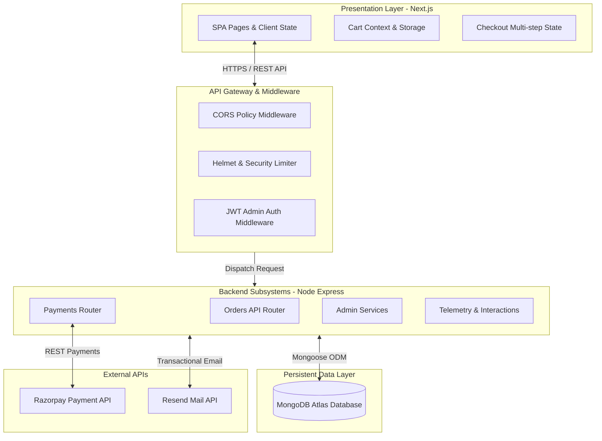

# Technical Architecture: Krushisarthi

This document provides a detailed breakdown of Krushisarthi's application architecture, subsystem communication, data schemas, and key design trade-offs. It is intended for software engineers and systems architects joining the project.

---

## 1. High-Level System Architecture

Krushisarthi utilizes a decoupled Client-Server architecture. The presentation layer is served by a modern Next.js client, which communicates asynchronously with an Express.js API Gateway backing onto a MongoDB Atlas cluster.



### Architectural Decisions & Tradeoffs

1. **Client-Side vs. Server-Side Rendering:**
   * *Decision:* The Next.js frontend uses **Client-Side Rendering (CSR)** and **Static Site Generation (SSG)** for catalog/informational pages, combined with strict API calls for checkout and administrative operations.
   * *Tradeoff:* Reduces server load on page requests while keeping database transactions centralized in a secure backend container.

2. **Decoupled Backend:**
   * *Decision:* The backend is a standalone Express.js server rather than Next.js serverless routes.
   * *Tradeoff:* Guarantees high-performance websocket operations, server uptime telemetry, and simplified persistent connections to MongoDB Atlas without serverless cold starts.

3. **No-SQL for Order History:**
   * *Decision:* MongoDB is selected as the primary document store.
   * *Tradeoff:* Matches the nested structure of transactional shopping carts (e.g., product arrays inside orders) without requiring complex JOIN queries.

---

## 2. Directory Structure

```
Krushisarthi/
├── Documentation/                 # Architectural specifications, checklists, and guides
├── backend/                       # Node.js Express Backend
│   ├── src/
│   │   ├── config/                # Database connection utilities
│   │   ├── middleware/            # JWT authentication, CORS, rate limits
│   │   ├── models/                # Mongoose Database Schemas (Order, Enquiry, Subscriber)
│   │   ├── routes/                # Express controllers mapping routes
│   │   ├── views/                 # HTML templates (Status dashboard UI)
│   │   └── server.js              # Application entry point
│   ├── .env.example               # Template for environment configuration
│   └── package.json
└── frontend/                      # Next.js App Router Frontend
    ├── app/                       # App Router routes and page components
    │   ├── admin/                 # Administrator fulfillment panel
    │   ├── checkout/              # Step-by-step transaction wizard
    │   ├── confirmation/          # Success page with printable tax invoice
    │   ├── select-products/       # Product catalog & quantity controls
    │   ├── track/                 # Public order query and tracking page
    │   └── layout.tsx             # Root layout with providers
    ├── components/                # Shared UI Components (Navbar, Footer, Providers)
    ├── lib/                       # API helpers & utilities
    ├── public/                    # Static image/icon assets
    ├── tailwind.config.ts         # Styling configuration (Amber & Stone Theme)
    └── package.json
```

---

## 3. Core Domain Models (Database Schemas)

The database utilizes three collection structures defined via Mongoose models:

### 3.1. Order Schema (`backend/src/models/Order.js`)

Defines all transactional metrics, customer data, and delivery configurations.

| Field | Type | Required | Description |
| :--- | :--- | :--- | :--- |
| `orderId` | `String` | Yes (Unique) | Sequential identifier, format: `KS-0001` |
| `customer.name` | `String` | Yes | Customer's full name |
| `customer.email` | `String` | Yes | Customer's email |
| `customer.mobile` | `String` | Yes | 10-digit mobile number |
| `shipping.address`| `String` | Yes | Physical delivery address |
| `shipping.city` | `String` | Yes | Delivery city |
| `shipping.state` | `String` | Yes | Delivery state |
| `shipping.pincode`| `String` | Yes | Postal index code |
| `shipping.deliveryZone`| `String` | Yes | Enums: `['local', 'state', 'national']` |
| `items` | `Array` | Yes | List of ordered products (ID, name, price, qty, image) |
| `financials.subtotal`| `Number` | Yes | Cumulative item cost before tax |
| `financials.gst` | `Number` | Yes | Calculated 5% tax split (CGST & SGST @ 2.5% each) |
| `financials.deliveryFee`| `Number` | Yes | Flat charge based on delivery zone |
| `financials.discount`| `Number` | Yes | Flat deduction from applied coupons |
| `financials.total` | `Number` | Yes | Final payable amount |
| `couponCode` | `String` | No | Applied voucher identifier |
| `paymentMethod` | `String` | Yes | Enums: `['upi', 'card', 'netbanking']` |
| `paymentStatus` | `String` | Yes | Enums: `['pending', 'paid', 'failed']` |
| `status` | `String` | Yes | Enums: `['received', 'processing', 'shipped', 'delivered', 'cancelled']` |

*Indexes:*
* `{ "customer.email": 1 }` - Optimizes CRM searching.
* `{ status: 1 }` - Speeds up admin order-tracking views.
* `{ paymentStatus: 1 }` - Facilitates accounting and reporting queries.

### 3.2. Subscriber Schema (`backend/src/models/Subscriber.js`)

Handles newsletter signups.

| Field | Type | Required | Description |
| :--- | :--- | :--- | :--- |
| `email` | `String` | Yes (Unique) | Registered email address |
| `createdAt` | `Date` | Yes | Auto-generated timestamp |

### 3.3. Enquiry Schema (`backend/src/models/Enquiry.js`)

Aggregates customer service queries.

| Field | Type | Required | Description |
| :--- | :--- | :--- | :--- |
| `name` | `String` | Yes | Contact person |
| `email` | `String` | Yes | Reply-to email |
| `subject` | `String` | Yes | Purpose of message |
| `message` | `String` | Yes | Message body |

---

## 4. Key Subsystem Workflows

### 4.1. Order Placement and Payment Verification

```
[Customer Selects Products]
           │
           ▼
[Checkout Wizard (Verify OTP & Fill Shipping)]
           │
           ▼
[Calculate Financials (Subtotal, GST, Coupons)]
           │
           ▼
[Call POST /api/orders (Store Pending Order)]
           │
           ▼
[Call POST /api/payments/create-razorpay-order] ──> [Initialize Razorpay Checkout UI]
                                                            │
                                                            ▼
                                                [Collect Payment Details]
                                                            │
                                                            ▼
[Execute Verification Webhook / Bypass API] <─── [Customer Completes Payment]
           │
           ▼
[Update Order to paymentStatus: 'paid']
           │
           ▼
[Trigger Automatic Dispatch Confirmation Email via Resend]
           │
           ▼
[Redirect to /confirmation Page (Confetti & Printable GST Receipt)]
```

### 4.2. Admin Telemetry and Fulfillment

* **Env Audit System:** On boot, the server evaluates all environment variables (`JWT_SECRET`, database URIs, Resend keys) and verifies their format using custom validators.
* **Server Health Page:** Rendering at `http://localhost:5000` is a raw HTML dashboard showing process memory status, CPU count, environment variables health check tables, database ping latency, and host diagnostics.
* **Fulfillment Operations:** Administrators log in via `/api/admin/login` using keys specified in env files. Upon credential validation, a JWT token is generated, allowing bulk update operations (`PATCH /api/orders/status`) and deletion calls (`DELETE /api/orders`).
